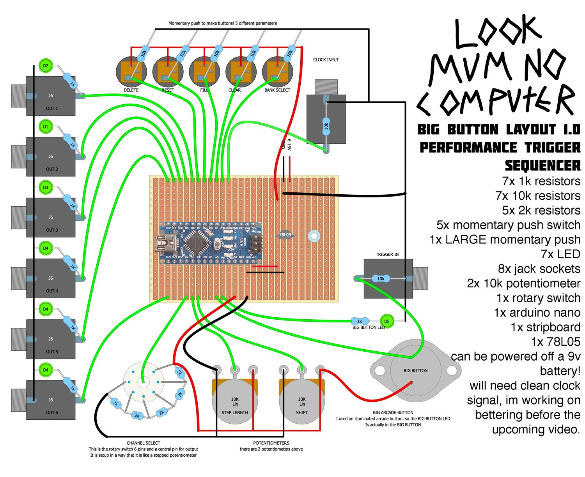

# Big-Button-Pico
LMNC Big Button remade with the Raspberry Pi Pico for Eurorack, with changes in code and functionality, and reprogrammed with micropython

[**New Documentation**](https://f113x.github.io/projects-documentation/archive/Big-Button-Pico/)

Original build and documentation: https://www.lookmumnocomputer.com/big-button

**Disclaimer:**

This project will not work by replacing arduino with pico from the original schmatics as new code is written and functionality has changed.  New project files including PCB & stripboard layouts will be uploaded.

BOM has been uploaded, but the project is not tested yet so only use as reference
**Please point out problems in the code as it has not been tested yet.**

## Ver 0.1 - Initial Commit
**Note: this version is largely defected due to issues in code and hardware. Use as reference only.**

|Process|Status|Time|
|-------|------|----|
|PCB|Drawn|-|
|Fabrication|Done|-|
|Build|Done|-|
|

Issues:
- Hole for buttons are not big enough
- Labels for knobs are too small
- Track switch component is incorrect
- Step length works strangely
- Some code issues have been fixed already.
- Power does not power on Pico (Fixed)
- Uncomfortable button

## Ver 0.2 - Under Development

New Features:
- Added title of module
- Placed mounting holes a bit closer together
- Connect Eurorack power to Raspberry Pi Pico
-

New Issues:
- None yet as build has not been built yet

## Programming Instructions:

### Flash latest micropython firmware into Raspberry Pi Pico
1. Hold BootSel button while plugging in the Raspberry Pi Pico, and a new drive should appear as 'RPI-RP2'
2. Upload flash_nuke.uf2 to the drive to remove any previous files in the controller if needed
3. The controller will automatically eject itself, unplug the cable
4. Repeat step one to go into BootSel mode
5. Upload micropython firmware (Latest: RPI_PICO-20231005-v1.21.0.uf2), and the controller will eject itself again
6. Reconnect the controller, and the firmware has been flashed in.

### Load Big Button code onto Raspberry Pi Pico
1. With the controller connected
2. Open the code with Thonny, and select device named 'MicroPython (Raspberry Pi Pico)'
3. Save the code onto the controller with the name 'main.py'
4. Unplug the controller, and the code should run automatically when powered on again

## Manual:
### Inputs:
|Input name|Type|Function|
|----------|----|--------|
|Delete|Button|Delete current step|
|Clear|Button|Clear current track|
|Reset|Button|Clear all tracks|
|Fill|Switch & Jack|When from CV or switch, a second sequence will be played instead of the first one|
|Clock|Jack|Input a clock signal for sequencer|
|Trigger|Big Button|trigger and record a pattern with the big button|

### Pots:
|Pot name|Function|
|--------|--------|
|Track|Select track 1-6|
|Step Length|Gate length of outputs|

### Outputs:
|Output name|Function|
|-----------|--------|
|1|First track output|
|2|Second track output|
|3|Third track output|
|4|Fourth track output|
|5|Fifth track output|
|6|Sixth track output|

## FAQ
None yet :)